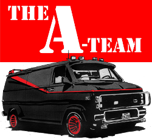

A Team - System Integration Project 
===================================



Udacity Term 3 Final Capstone Project

## The A Team
Slack channel - *#ateam*

### Schedule

Project Due:
**2017-10-02**

Term Ends: 2017-10-16

```
Su Mo Tu We Th Fr Sa  
10 11 12 13 14 15 16  
17 18 19 20 21 22 23
24 25 26 27 28 29 30  September 2017       
 1  2  3  4  5  6  7  October 2017      
 8  9 10 11 12 13 14  
15 16 17 18 19 20 21  
```

### Skype Calls
* **Success!** 2017-09-10 1500UTC=0800PDT=1700U+2
* **Success!** 2017-09-17 1500UTC=0900PDT=1800U+2
* **PLANNED!** 2017-09-24 1500UTC=0900PDT=1800U+2

### Members
  - 0 Chris _@cxed_ UTC-7
  - 1 Vince _@vincec_ UTC-7
  - 2 William _@williambeverly_ UTC+2
  - 3 Andreas _@jankl.andreas_ UTC+2
  - 4 Markus _@markus.meyerhofer_ UTC+2

[Team Sign Up Spreadsheet](https://docs.google.com/spreadsheets/d/17I_0q8tylk9Q_Y3GTSq738KkBIoS6SUt1quR5lPPAdg/edit#gid=0)

### Sub Tasks
* Team leader 0:
  - set up team resources (Slack, GitHub, Skype, etc),
  - documentation
  - coordination
  - testing
  - programming support
  - removing tabs
* Vince & William: waypoint updater a.k.a. getting the car moving at all.
  - making the car drive
  - making the car drive smoothly
  - making the car drive smoothly as long as we want
  - stopping the car when told that's a good idea
  - resuming the car when told that's a good idea
* Andreas & Markus: tl_detector, working on the classifier.
  - detecting the state of any visible traffic lights
  - deciding when a stop should be done based on traffic light state

## Project Components

### Nodes


#### Perception
* Traffic light detection
* Obstacle detection

#### Planning
* Waypoint updater - Sets target velocity for each waypoint based on traffic light and obstacles.

#### Control
* Drive by wire ROS node -
  - input: target trajectory
  - output: control commands to vehicle
* Here's a handy flowchart for PID tuning.


### Car Info
* throttle range = 0 to 1.0
* Official docs on brake value says: `...units of torque (N*m). The
  correct values for brake can be computed using the desired
  acceleration, weight of the vehicle, and wheel radius.`
* Carla is a https://en.wikipedia.org/wiki/Lincoln_MKZ
  - Curb weight = 3,713-3,911 lb (1,684-1,774 kg)
  - `/dbw_node/vehicle_mass`: 1080.0
  - 726 g/L density of gas. 13.5gal=51.1Liters, max fuel mass=37.1kg
  - 4 passengers = 280 kg
  - Let's just say 2000kg for a deployed car.
* Decel_Force(newtons) = Mass_car(kg) * Max_decel(meter/s^2) 
* MaxBrakeTorque(newton * meter) = Decel_Force(newtons) * wheel_radius(meters) / 4 wheels
* MaxBrakeTorque(newton * meter) = Mass_car(kg) * Max_decel(meter/s^2) * wheel_radius(meters) / 4 wheels
* Wheel radius
  - `rospy.get_param('~wheel_radius', 0.2413)` but...
  - `/dbw_node/wheel_radius`: 0.335
  - Chris independently calculated the wheel radius to be .340m
  - ...so let's go with .335
* MaxBrakeTorque
  - (newton * meter) = 2000(kg) * 5(meter/s^2) * .335(meters) / 4 wheels
  - MaxBrakeTorque= 837.5Nm

### Explicit Requirements
* Code via GitHub
* README.md

## TODO
1. The Waypoint Updater Node seems to be a prerequisite to many other components
   so it is recommended to work on it first.
2. DBW (Drive By Wire) Node
3. Traffic Light Detection
4. Waypoint Updater Node - full functionality.

### Find Tabs To Eliminate

```
find . -iname '*py' | while read N; do echo "== $N"; grep $'\t' $N ; done
```

## Run

```
catkin_make && source devel/setup.sh && roslaunch launch/styx.launch
rosbag play -l just_traffic_light.bag
rqt_image_view /image_color
rqt_console
```


## References and Links
* [CarND-Capstone Repo](https://github.com/udacity/CarND-Capstone)
* [VM image](https://classroom.udacity.com/nanodegrees/nd013/parts/6047fe34-d93c-4f50-8336-b70ef10cb4b2/modules/e1a23b06-329a-4684-a717-ad476f0d8dff/lessons/7e3627d7-14f7-4a33-9dbf-75c98a6e411b/concepts/8c742938-8436-4d3d-9939-31e40284e7a6?contentVersion=1.0.0&contentLocale=en-us)
* [Simulator](https://github.com/udacity/CarND-Capstone/releases/tag/v1.1)
* [Dataspeed DBW](https://bitbucket.org/DataspeedInc/dbw_mkz_ros)
* [Traffic Light Detection Test Video - a ROS bag](https://drive.google.com/file/d/0B2_h37bMVw3iYkdJTlRSUlJIamM/view?usp=sharing)
* [Starter Repo](https://github.com/udacity/CarND-System-Integration)
* [ROS Twist](http://docs.ros.org/jade/api/geometry_msgs/html/msg/Twist.html)

### Notable Slack Channels
* _#p-system-integration_ - Seems to be where this project is being discussed.
* _#sdc-ros_ - ROS topics.
* [Discussion Forum - System Integration](https://discussions.udacity.com/c/nd013-system-integration)

## Interesting Chatter From Forums/Slack
Seems like this could go sideways easily. Let's be careful to double
check degrees/radians and get consistent.

> Seems that `waypoint_loader.py` is feeding degrees to
> `quaternion_from_euler` which expects radians… and `bridge.py` is
> feeding radians to `create_light` which expects degrees.
> --   #davidm 2017-09-07

And in a similar theme...

> probably the simulator calculates in kmh, displays in mph and wants
> data in mps
> -- #kostas.oreopoulos 2017-09-07

[?](https://discussions.udacity.com/t/units-for-ros-topics-in-the-final-project/360954/1)
